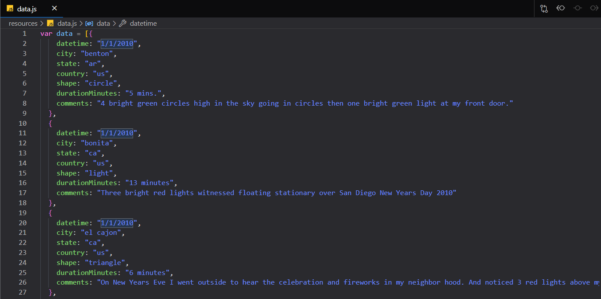

# [UFO Sightings](https://cckuqui.github.io/UFO-sighting/index.html)

## Data

For this exercise I used a JavaScript object containing eye-witness reports of UFO sightings with:

* Date/time
* City
* State
* Country
* Shape
* Duration in Minutes
* Comments

### Objective

* Append table with all data into the webpage
* Create filters for date/time, city, state, country, and shape

## Results

### Copyright

First image retrived from [Sci-fy Addicts](http://scifiaddicts.com/sci-fi-books-survive-alien-abduction/) on 15/07/2020.
